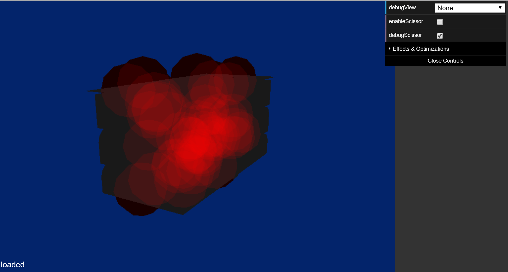
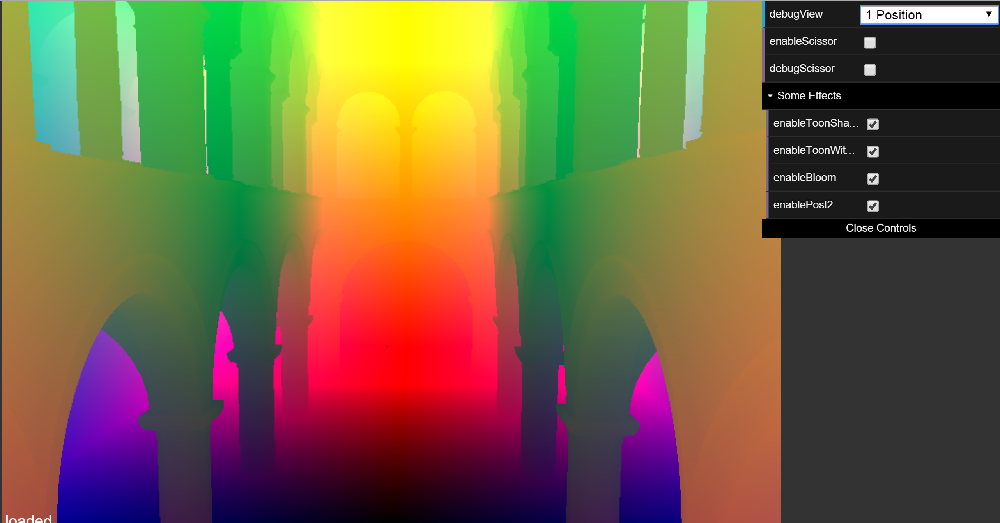
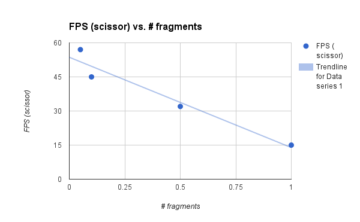

WebGL Deferred Shading
======================

**University of Pennsylvania, CIS 565: GPU Programming and Architecture, Project 6**

* Levi Cai
* Tested on: **Google Chrome** on
  Windows 8, i7-5500U @ 2.4GHz, 12GB, NVidia GeForce 940M 2GB

### Live Online

### Demo Video

(Apologize for the low-quality video, none of the screen recorders seem to work)
https://www.youtube.com/watch?v=8UpVNrFkYcw&feature=em-upload_owner

### Features and Optimizations

All features turned on at once:

## Toon Shading (with Ramp Shading option)

Toon shading was implemented in the deferred shader stage. It simply takes the diffuse cosine output and creates a sep function from that output, such that there are only a limited number of intensities available to a pixel. This was implemented primarily with if-statements and could probably be improved by removing the if-statements in favour of boolean math. There is an additional option to use ramp shading for the smaller values of intensities so that they are more gradual (simply uses the cosine output at this stage). Lines were created by checking the depth of a pixel compared to its neighbor pixels. If they are different by some threshold, the pixel is coloured white. The thickness of the line can be tuned by which neighbors to consider.

There seems to be very little performance impact however.

## Naive Bloom Effect

This effect is accomplished with a simple 1-pass post processing stage. The output from the deferred shader is taken and a pixel's intensity is increased based on its neighbor's intensities. The amount increased is determined by a simple 5x5 block kernel (set to all 0.1's, but this can be tweaked). This is slow in the sense that each thread must then compute 25 values in a for loop. However, this too did not seem to have as dramatic an impact on performance as one might think (could not differentiate by FPS/ms with stats.js).

## Bloom Effect with 2 Pass Separable Filter

An improvement to the efficiency of the bloom effect is to use a separable kernel and render it in 2 separate passes. To do this I added an additional post-processing stage. In the first post-processing stage, the first part of the kernel, a 5x1 kernel is applied. Then in the second stage, a 1x5 kernel is applied. Since this can be thought of as a guassian convolution operation, it is clear that this accomplishes the same effect as above, however, each pass only needs to do 5 operations (and so 10 total) per pixel, compared to the 25 from before.

## Box Scissor Testing vs Sphere Proxy Geometry Optimization

The first optimization to make is to only render fragments that are actually reachable by light sources. There are a variety of ways to determine which fragments are reachable however.

The most naive implementation is to use a simple scissor test, which creates a bounding box around each light source (where the sphere of the light radius is inscribed in the box). If a fragment lies outside of the light's box, then it does not need to computre contributions from that light source. We can see a debug view of the boxes here (analysis further below):

A tighter optimization is to bound the light sphere itself using proxy geometry. This is accomplished by creating a new vertex shader to compute the spheres surrounding each light source. Once we compute the spheres, we can then use the transformed sphere's triangles for shading. Though there are many more triangles now to shade, we do not end up wasting any time computing light contributions from regions that were missed by the previous bounding box implemention (bounding box - sphere = amount of wasted computation per light). (Again, analysis further below)

### Debug Views

Depth:

Positions:

Normals:

### Performance Analysis and Additional Optimizations

One optimization used was to reduce the size of the g-buffers from 4 to 3. This was achieved by splitting a vec3 by putting each of its components into separate g-buffers.

Below is a comparison between the number of lights and the optimization technique used. It is easy to see that the number of lights greatly effects the runtime, as there are many more fragments that must be computed. However, it is also clear that the spherical optimization is better than the naive bounding box method, which in turn, is significantly better than no optimization at all.

The following comparison was achieved by zooming out from the building, in order to see that the number of fragments needed to be rasterized greatly effects performance. As we zoom out, there are less fragments that must be rendered (shown as a % of screen covered), and hence much faster performance.

We can also see from the chrome profiler that a fairly significant portion of time is spent passing uniforms into the shaders.

